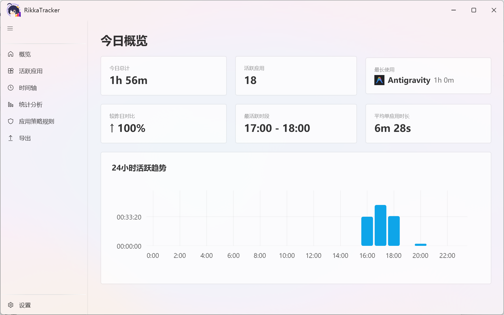
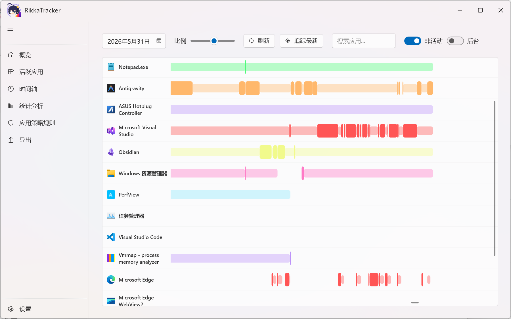
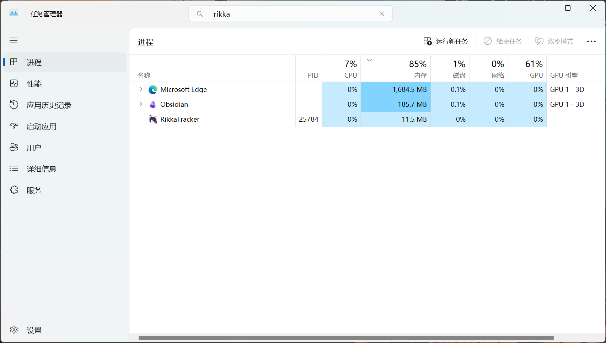
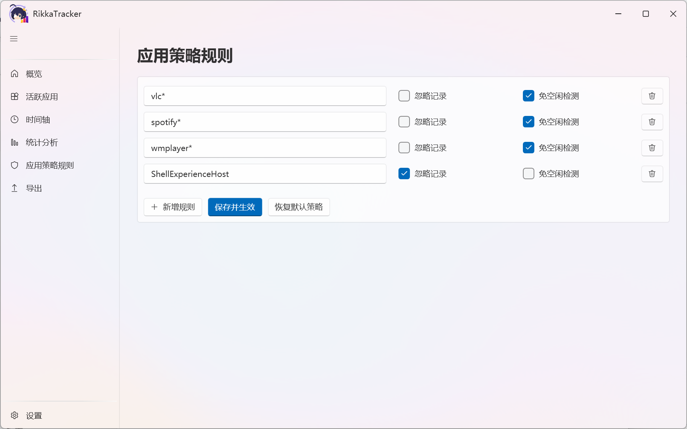

<div align="center">
    
  
  
# RikkaTracker

<br>

**[ENGLISH README](README.md)**

</div>


**RikkaTracker** 是一款专为 Windows 设计的轻量级应用活动追踪工具。它能够精确记录并分析您在电脑上的每一分钟，通过直观的时间轴（甘特图）和多维度的统计数据，帮助您洞察时间分配，优化工作效率。

---

## 核心特性

### 1. 三档活动追踪模型
不同于简单的“运行时间”统计，RikkaTracker 采用深度的三层状态机模型：
- **前台活跃 (Foreground Active)**：您正在操作的应用（焦点窗口 + 实时交互）。
- **前台非活动 (Foreground Inactive)**：窗口可见但非焦点，或因空闲超时自动降级。
- **后台运行 (Background)**：进程存活但窗口最小化或无窗口，为您保留应用全生命周期的完整记录。

### 2. “时间轴”视图
基于高性能 `DrawingVisual` 混合绘制技术，RikkaTracker 提供了一个极为流畅的时间线界面：
- **视觉分级**：根据活动状态自动调整线条粗细与颜色深浅，一眼区分专注时段与挂机时间。
- **无缝缩放**：支持从小时到分钟级的自由缩放，精确还原全天活动细节。
- **智能交互**：毫秒级响应的悬浮提示，动态展示应用名称、窗口标题及持续时长。

### 3. 极致轻量，超低资源占用
- 极致轻量化运行优化，摒弃冗余功能与低效渲染逻辑，基于原生 WPF 高性能渲染方案开发。
- 程序后台常驻内存占用极低，CPU 占用几乎可忽略不计，全程无弹窗、无后台冗余进程、无网络驻留请求。完美适配日常长期后台静默运行，不会对电脑性能、游戏帧率、办公软件运行造成任何影响，真正实现无感式时间追踪。

### 4. 网页浏览追踪与 Chrome 扩展
- 支持通过浏览器扩展实时追踪浏览器活跃页面，记录浏览时长。
- 域名自动映射为友好网站名称（如 `google.com` → "Google"），提升界面可读性。
- 视图模式可在"仅应用 / 仅网页 / 合并"之间切换，灵活查看不同维度数据。

---










---

## 快速开始

### 环境要求
- Windows 10/11
- .NET 8.0 SDK
- Visual Studio 2022

### 构建步骤
1. 克隆仓库：
   ```bash
   git clone https://github.com/remnant-song/RikkaTracker.git
   ```
2. 使用 Visual Studio 打开 `RikkaTracker.sln`。

---
*Developed with ❤️ by [remnant-song](https://github.com/remnant-song)*
