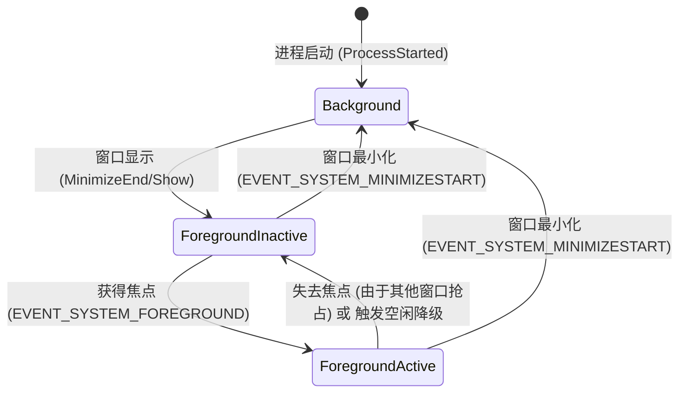
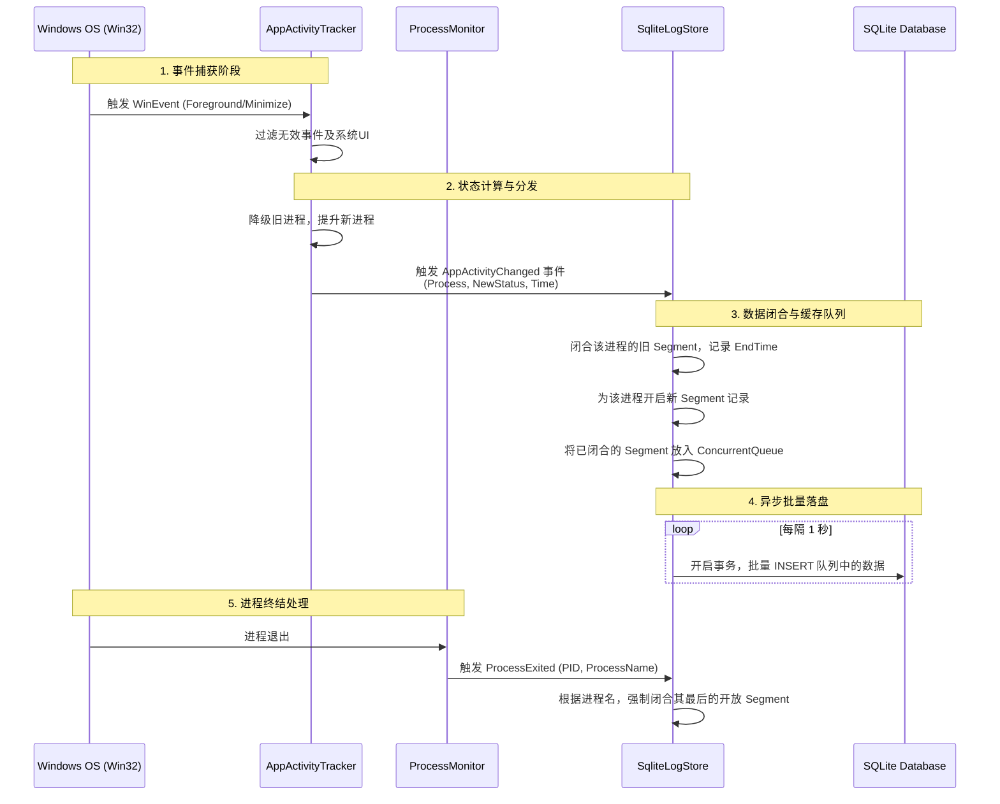

# RikkaTracker 核心监控与记录架构设计报告

本文档总结了 RikkaTracker 项目在 3.0 版本架构下，核心监控与记录模块（Core.Monitor & Core.Data）的设计理念、状态模型以及底层数据流转机制。

## 一、 核心状态模型设计

项目放弃了传统的“仅记录焦点窗口”的单线追踪模式，转而采用**基于进程独立生命周期的树状多态模型**。系统中的每一个受监控进程，在任意时刻都必然且唯一地处于以下三种状态之一：

| 状态枚举值 | 状态名称 | 触发与判断条件 | 业务意义 |
| :---: | :--- | :--- | :--- |
| **0** | **Background (后台)** | 进程存在运行，但其所有窗口均处于不可见状态（如全部最小化、隐藏到托盘、或纯后台服务进程）。 | 不计入用户的有效使用时长，但对于诸如后台音乐播放、下载等场景，保留了记录“存活时长”的能力。 |
| **1** | **ForegroundInactive (前台非活动)** | 进程至少有一个窗口是可见的（未最小化），但该窗口**不具有当前系统的输入焦点**；或者该进程虽然具有焦点，但用户长时间未操作触发了**空闲降级**。 | 用户的注意力不在此应用上，但应用仍占据屏幕空间。它构成了甘特图中连接活跃片段的“底纹”，真实反映了用户的工作台状态。 |
| **2** | **ForegroundActive (前台活动)** | 进程的一个窗口拥有系统输入焦点，且用户正在持续进行键鼠交互（未触发空闲超时）。 | 这是绝对意义上的“正在使用”，是统计用户活跃投入时间的核心指标。 |

---

## 二、 状态流转与触发逻辑

状态的流转由底层的 `Win32Api` 事件挂钩（Hook）和系统级空闲检测（`GetLastInputInfo`）共同驱动。状态机在 `AppActivityTracker` 中进行维护。

### 2.1 状态转换矩阵与事件源



---

## 三、 焦点竞争与抢占机制 (Focus Preemption)

基于 Windows 内核窗口管理器的设计规则——**系统级输入焦点（Keyboard/Mouse Focus）在同一时间只能被唯一一个窗口持有**。

RikkaTracker 在 `AppActivityTracker` 中实现了严格的**焦点抢占逻辑**：

1.  **唯一性约束**：在任何时刻，系统中处于 `ForegroundActive (2)` 状态的进程数量必然为 `0` 或 `1`。
2.  **抢占流程**：
    *   当进程 A 获得系统焦点（触发 `EVENT_SYSTEM_FOREGROUND`）时，系统会首先检查当前是否存在状态为 `ForegroundActive` 的进程 B。
    *   若存在进程 B，系统会强制将其状态降级为 `ForegroundInactive`（如果其窗口仍可见）或 `Background`（如果已不可见）。
    *   随后，进程 A 才会从 `ForegroundInactive` 或 `Background` 提升为 `ForegroundActive`。
3.  **空闲降级与竞争**：当进程 A 因为空闲而降级为 `ForegroundInactive` 时，系统当前处于“无活跃焦点”状态（Active 进程数为 0）。此时，只要用户在该窗口内产生任何输入，进程 A 会立即抢回 Active 状态。

这种机制确保了统计数据的绝对准确，防止了因为状态切换不完整导致的“多应用同时活跃”的数据逻辑错误。
    Background --> ForegroundInactive : 窗口恢复显示\n(MINIMIZEEND/未获焦点)
    Background --> ForegroundActive : 窗口恢复并获焦点\n(FOREGROUND)
    
    ForegroundInactive --> Background : 窗口被最小化\n(MINIMIZESTART)
    ForegroundInactive --> ForegroundActive : 获得输入焦点\n(FOREGROUND)
    ForegroundInactive --> ForegroundActive : 用户恢复键鼠输入\n(解除空闲)
    
    ForegroundActive --> ForegroundInactive : 失去输入焦点\n(FOREGROUND 转移)
    ForegroundActive --> ForegroundInactive : 用户长时间无操作\n(Idle Timer 超时)
    ForegroundActive --> Background : 窗口被最小化\n(MINIMIZESTART)
    
    Background --> [*] : 进程退出
    ForegroundInactive --> [*] : 进程退出
    ForegroundActive --> [*] : 进程退出
```

### 2.2 核心切换策略详解
- **焦点转移的精准接力**：当系统发生 `EVENT_SYSTEM_FOREGROUND` 事件时，系统不仅提升新焦点进程的状态至 `2`，还会**回查旧焦点进程的真实状态**：如果旧焦点窗口依然可见，则精准降级为 `1`；如果它已经被最小化了，则降级为 `0`。
- **持续的空闲唤醒链路**：空闲检测机制并非触发后即死。当用户因无操作被降级到 `1` 后，后台的 Timer 会持续探测。一旦发现用户恢复输入，系统无需等待新的焦点事件，即可**原位将状态拉升回 `2`**。
- **多并发追踪**：上述状态流转对每个进程是**完全独立计算**的，A 进程获得焦点变成 `2` 时，B 进程在后台依然保持其 `1` 或 `0` 的演进，互不干扰。

---

## 三、 监控与记录系统架构

为了实现极低的 CPU/内存占用以及保证写入的连续性，系统将“状态探测”、“状态计算”与“数据落盘”进行了严密的解耦。

### 3.1 核心组件交互架构图



### 3.2 `SqliteLogStore` 并发记录设计
`SqliteLogStore` 是保证数据连续不断链的核心枢纽。
- **并行字典追踪**：内部维护了一个 `Dictionary<string, ActivitySegment> _openSegments`。当 Tracker 发来状态变更时，Store 仅根据进程名定位并切断该进程的时间轴，生成一个完整的时间片段（Segment），随后将新状态写入字典。
- **微短片段过滤**：在片段推入写入队列前，会自动过滤掉持续时间极短（如小于 100 毫秒）的瞬间状态过渡，防止数据库产生无意义的垃圾碎片数据。
- **跨日无缝拆分**：如果一个状态段（如通宵挂机的游戏）横跨了午夜 0 点，入队前会被自动切割为当天 23:59:59 结束和次日 00:00:00 开始的两条记录，极大方便了后续按自然日进行的 SQL 聚合查询。

## 结语

当前的监控与记录架构，通过 **按进程切分的独立状态机** 和 **精准过滤的 Win32 事件泵**，彻底解决了多窗口并行时的时间线相互覆盖问题。搭配 SQLite 高性能的内存事务批量写入，既保证了能捕捉到连续、无死角的使用习惯脉络，又将系统常驻资源的消耗压制到了最低。
